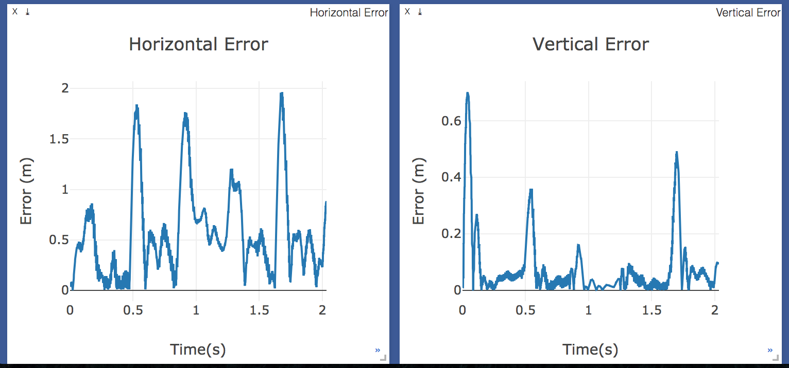
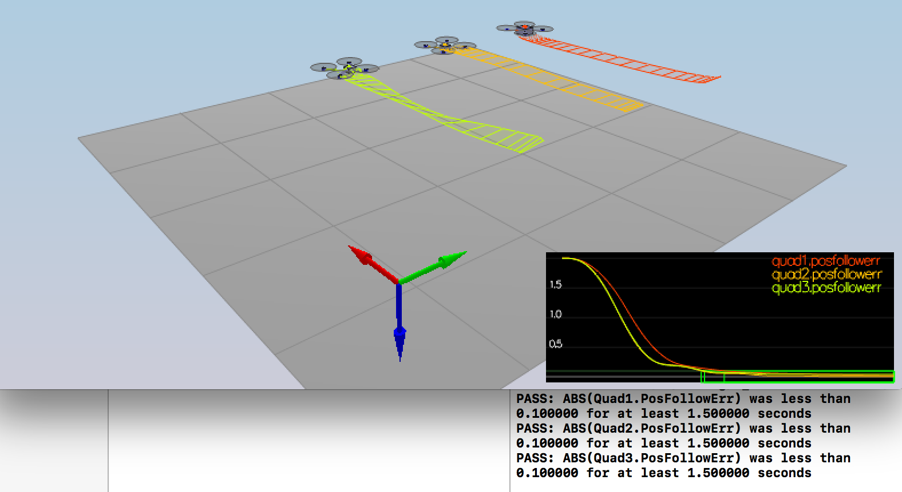

## Project: 3D Controls


---


# Included in this project:
1. Python controller code (with parameters) and Telemetry log
2. C++ controller code and tuned parameters

## Python Implementation
1. After basic setup (using baseline `controls_flyer.py`) I started with a drone that was incapable of flying.
2. I first implemented `body_rate_control()`, `altitude_control()`, and `yaw_control()`.
3. After satisfactory performance with the above, I implemented `roll_pitch_control()` and `lateral_position_control()`

Note: The first three controls below were tuned by isolating the system with a varity of strategies 
randing from setting a simple target trajectory `np.array([0.0, 0.0, -3.0])` to doing things like
setting the target acceleration to 0.0, etc. etc. 

### Body Rate Control
* Simple proportional controller with relatively high gains 
* Assuming appropriate units for gain so that predicted value in angular acceleration (rad/s^2)
* And finally converting angular acceleration to the required output torque using moments of inertia.
* I also took care to clip the output torque within limits of operation, i.e. MAX_TORQUE
* I assumed that rotational torque can be both clock-wise and anti-clock-wise with above maximum.

### Yaw Rate Control
* Simple proportional controller with with moderate gain. 
* This was easy to tune by setting a manual yaw_cmd of 1 radian (for example) and seeing the drone turn
* Tuned manually for a satisfactory feel of settling time. 
* When tested on figure 8 trajectory, I noticed that some turn commands resulted in greater than 180 degree yaw.
* In such cases its better to turn in the opposite way (shorter). Added code to handle this.
* Logic: check which of [yaw_cmd, yaw_cmd-2pi, yaw_cmd+2pi] is closer to current yaw in absolute value.
* Locic: Then pass the error (sign included) to the P-controller.

### Altitude Control
* A feedfoward PD controller was used for this as suggested.
* In the python implementation I noticed that 9.81 (g) was passed in as the feedforward term.
* While the above seemed confusing (and in contradication with c++ setup), I worked out the appropriate math/signs for correct thrust.
* Accounted for non-linearities from rotation by using R33 (in paper/course) to modify required thrust.
* I have commented on how I managed (+up) vs (-down) directions to get thrust in correct direction.
* I then clipped the output thrust to be between 0 and MAX_THRUST for practical considerations. 
* Tuned manually with simple height target.

### Roll Pitch Control
* Proportional controller with non-linearities accounted for using math from this [paper](http://www.dynsyslab.org/wp-content/papercite-data/pdf/schoellig-acc12.pdf)
* Took care to account for sign convention changes between lessons/paper/python setup. 
* Returns pitch rate commands (p & q) in rad/s
* Tuning this was relatively harder. Having confidence in the earlier three controllers already being stable helped. 
* Gains had to be kept relatively low, to keep drone from crashing and the tuning was performed on the test trajectory.

### Lateral Position Control
* A feedforward PD controller was used for this as suggested.
* Tuning was done using the test trajectory. 

#### Results

I was able to get the test trajectory running as fast as using time scaller --> 0.6. But this depended 
a lot on what size of simulator I was running, and how much my laptops graphics card was struggling (battery level, etc.). 
I found it best to use the small/medium size. I tested using both my own `backyard_flyer.py` and the provided `controls_flyer.py`.
Using the web visualizer I was able to verify that the errors were within bounds, in addition to the python code reporting 
success in traversal. 

```
Maximum Horizontal Error:  1.8365147830528779
Maximum Vertical Error:  0.7872702537985745
Mission Time:  2.020544
Mission Success:  True
```




## C++ Implementation

Overall the controls architecture is pretty much the same in this implementation. While this implementation isn't a black box code translation of the python implementation, the controls architecture (i.e. a cascaded controller with altitdude, roll_pitch, and yaw controller sending commands to a body rate controller at the inner most loop, and a position controller in the outer most loop) is pretty much the same. In this writeup I will focus on how I tuned the c++ imlementation and call out the major differences as I walk through the scenarios. 


### Scenario 1: Intro

This one was pretty straight forward. The initial mass set to in `QuadControlsParameter.txt` was 0.4. I reasoned that in the absense of any control, the initial hard coded thrust per motor, i.e.,  `QuadControlParams.Mass * 9.81 / 4` was set for a lower mass. So I started increasing the mass and a little bit of over shooting on both sides, I settled on a nice round number of 0.5 Kgs to pass this scenarios. 


### Scenario 2: Attitude Control

This scenario starts with a quad rotor with an initial omega, and clearly
without any body rate control or yaw control it would crash. At this point 
I went ahead and implemented `AltitudeControl()`, `BodyRateControl()`, and `YawRateControl()`. I made sure the output of the other controllers was zero at this point. Here are the differences I noticed between c++ and python in implementing these.

#### Generate Motor Commands
   Before proceeding with implementing the controllers we need to make
   sure that the calculated command thrust (Ftotal) and command moments (taux, tauy, tauz) need to be converted to appropriate forces for each rotor (in Newtons). To implement this, I solved the linear set of equations that relate the linear forces to the moments acting on the rotor while still satisfying the fact that Ftotal = F1 + F2 + F3 + F4. This equation along with the other moment equations helped me solve for each individual force. Inter motor distance given as L needed to be converted to the moment-arm distance, and care had to be taken to use the correct sign for axial moments acting on account of rotation (z-direction).
   
#### Inner Controllers:
* Altitude Control: Implemented as a feedforward PID controller (I set to zero for initial tuning) has a feedforward of 0 (was 9.81 in python). I accounted for this with `-u_bar_1 + 9.81` and as usual I set all the signs in these formulas by making simple logical conclusions on "I increase this command, what should happen to this control?". Non linearities from rotation matrix were included. Also care was taken to clip the commanded acceleration and commanded thrust to be within the configurable min and max values.
* Yaw Rate Control: Simple Proportional controller. As suggested I used `fmodf` to keep the angles within 0 and 2*pi. 
* Body Rate Control: Simple Proportional controller using moments-of-interia to convert angular rotation rates to moments. 

#### Tuning:
For this scenario to pass the critical part was tuning the inner most loop, i.e, the body rate controller. To first tune the Altitude and Yaw controller, I modified `2_AttitudeControl.txt` to set the initial omega to 0.0, and instead set initial yaw to a small value. I also temporarily lengtened the simulation time to 5 seconds to see how the controls played out. I plotted yaw plots on the visualizer to choose a satisfactory value for `kpYaw=5` (at this point). Similarly for the Altitude controller, I made sanity checks to make sure thrust was in the correct direction. At some point (during this or next scenario) I noticed that the max thrust was not enough for a weight of 0.5 Kgs, and increased it from 4.5 to 5.0 to begin with.
At this point my tuned values for altitude control were `kpVelZ = 20` and `kpPosZ = 4`. For tuning the Body Rate controller, I set the omega value back to 30.0, and then started live tuning the parameters (slowly increasing them) while watching the visualizer. At this point I ended close to the final values of `kpPQR = 80, 80, 20`.


### Scenario 3. Position Control

For this scenario to work, the `RollPitchController()` and the `LateralPositionController()` need to be implemented. 


#### Outer Controllers:

* Roll Pitch Controller: Proportional P-controller with non linearities (similar to python implementation).
* Lateral Position Controller: PD-controller with feedforward term. Since we were using `V3F` to do all our math in the c++ implementation, care had to be taken to not affect values in the z-direction for this.

#### Tuning:
This was the most challenging part of the tuning process. Right off the bat I was lucky to get one of the tests already passing (Quad2.Yaw settled quite well). But I noticed that the drone "Rocked back and forth" in its progress. Careful inspection of the code made it clear to me that the c++ implementation `GetNextTrajectoryPoint` did not provide any velocity targets (only position targets) unlike the python implementation `trajectory_control`). This meant that every time the drone moved the differential part of the PD controller in the lateral position controller would "complain" anytime the velocity was not zero. I tried setting a constant velocity (in the direction of the commanded position, and then normalizing it), but this made it harder for me to tune, and I went back to the default use case of `velCmd = (0,0,0)`. After a lot of plotting, and live tuning I realized that the key trade-off was between tuning `kpBank`, and the previously tuned `kpYaw`. I had to temper `kpYaw` to a lower value (2.5) and slowly increase the `kpBank` value very carefully. I also had to simultaneusly search for a good value of `kpPQR` to keep (Quad2.Pos.X from ping-ponging). 


### Scenario 4. NonIdealities

The non idealities introduced here were two-folds
1. Quad1 was heavier than so far previously encountered (0.8 Kgs).
2. Quad3 had an off-center center of mass by (cy = -0.5 m). 

To address the first issue, I first realized that a `maxMotorThrust = 5.0` (I had set this during tuning Attitude Controller wasn't enough to counter a weight of 0.8kgs). This was primarily the reason why it was nose-diving. I therefore increased it to a final value of `maxMotorThrust = 10.0` to comfortably account upto approximately a 1Kg drone mass. 

To address both issues in general (model errors), I started introducing PID control effect into the `AltitudeControl()` by setting non-zero posistive values to `KiPosZ`. I had previously implemented the integration term in preparation for this scenario. To tune the Kp, Kd, and Ki for this controller, I kind of started from scratch again by first setting Kp (till it started oscillating), and then setting a positive value for Ki, and then adding Kd and fine tuning these too back and forth. 




### Scenario 5. Trajectory Follow


